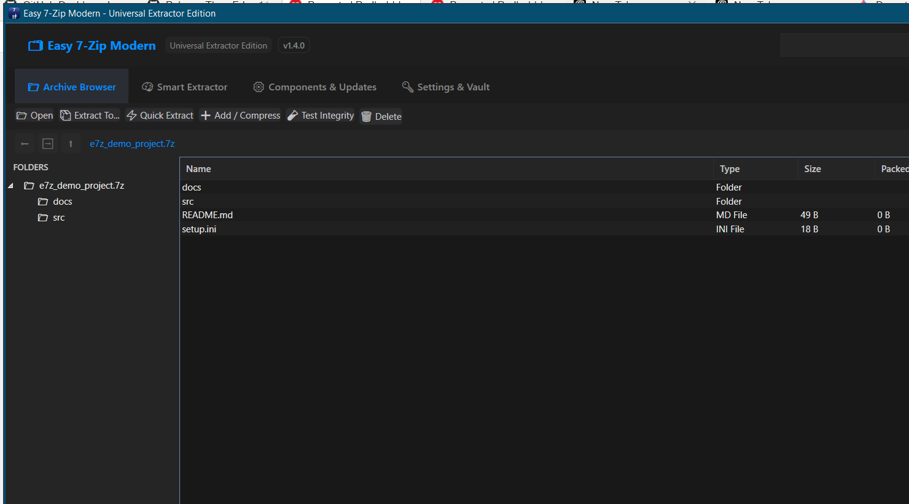
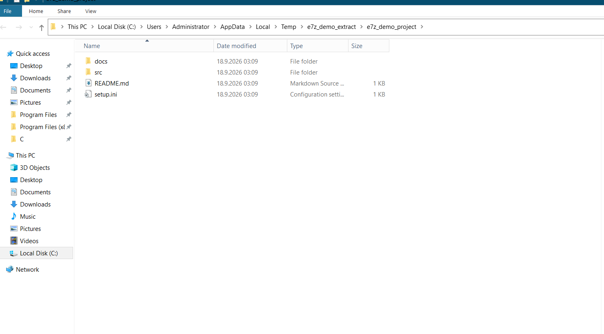
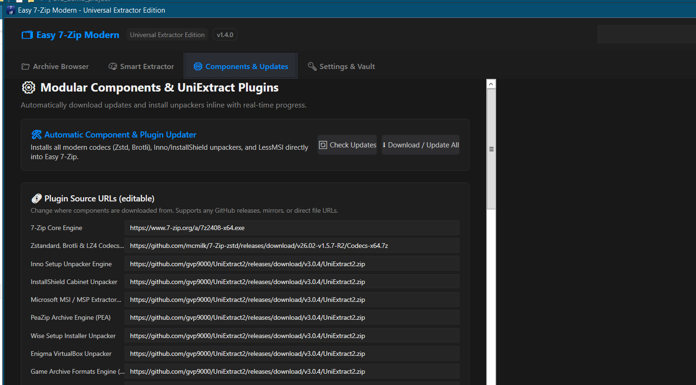
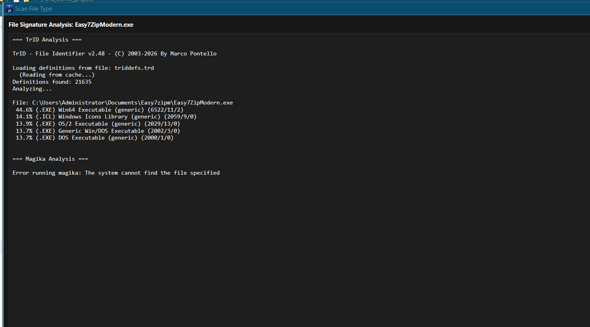

# 🗂 Easy 7-Zip Modern — Universal Extractor Edition

A modern WPF front-end for 7-Zip and the UniExtract2 tool suite. Browse archive
contents with a real file-manager interface, extract with the right engine
picked automatically, identify any file's true format from its binary
signature, keep codec and unpacker plugins up to date from editable URLs, and
never get stuck on a password again.


---

## ✨ Features

### 📁 Archive Browser
A file manager for archive contents — no flat listing, no guessing:

- **Folder tree side panel** — resizable, toggleable (`🗂 Tree`), and two-way
  synced with the file grid: click a tree folder to jump there; navigate in the
  grid and the tree expands, selects, and scrolls to match
- **File-manager navigation** — double-click (or Enter) to descend into a
  folder, **⬅ Back / ➡ Forward / ⬆ Up** buttons with full history, a clickable
  **breadcrumb bar** (`archive › docs › deep`), plus a `..` row and **Backspace**
  for quick parent hops
- **Live search** scoped to the current folder
- **Preview files** — double-click any file to extract it to a temp folder and
  open it with the default application
- **Drag & drop anywhere** — plain archives open in the browser; installers and
  MSI packages route straight to the Smart Extractor
- Handles any archive 7-Zip or the plugin suite supports:
  `.7z .zip .rar .tar .gz .xz .zst .iso .cab .wim .msi .pea` and dozens more
- Status bar with file/folder counts, total size, detected engine, and
  encryption state

### 🧠 Smart Extractor
Picks the right engine for the job automatically:

| Engine | Handles |
|---|---|
| **7-Zip core** | 7z, zip, rar, tar, iso, and dozens more |
| **InnoUnp** | Inno Setup installers |
| **Unshield** | InstallShield cabinets |
| **LessMSI** | MSI / MSP packages |
| **PeaZip / Wise / EnigmaVB / GARbro / UnRPA** | Via the UniExtract plugin set |

- Real-time progress, per-file log, optional subfolder, auto-open destination,
  optional source deletion
- Encrypted archives unlock automatically from the password vault

### 🔎 File-Type Scanner
Know what you're looking at before you extract. Right-click any file in
Explorer and pick **Scan file type (TrID)**, or run `Easy7ZipModern.exe <file>
/scan`:

- **TrID signature analysis** — matches the file against 18,000+ binary
  definitions (bundled with the plugin suite) to reveal the real format, even
  with a missing, wrong, or extension-less name — with a confidence percentage
  for each candidate
- **Magika analysis** (optional) — if Google's Magika is on `PATH` or in
  `bin\`, its AI-based detection runs as a second opinion
- Themed results window; the **Format & Signature Detectors** entry in the
  Components tab installs/updates TrID and ExeInfo

### 📌 Explorer Context Menu
Integrate into Windows Explorer right-click menus on every file and folder:

- **Open**, **Extract files…**, **Extract Here**, **Extract to <Folder>\**,
  **Test archive**, **Add to archive…**
- One-click compression: **Add to <name>.7z** and **Add to <name>.zip**
- **CRC SHA** submenu — CRC-32 / CRC-64 / SHA-1 / SHA-256 / all hashes
- **Scan file type (TrID)** — signature analysis from the menu
- Flat menu or cascaded under **Easy 7-Zip Modern ▸**; optional icons; per-item
  toggles in Settings

### ⚙ Components & Plugins
- One-click **Download / Update All** with per-component progress and speed
- **Editable plugin source URLs** — point any component at a GitHub release,
  mirror, or direct file URL
- **Add custom plugins** — name + URL + optional verification file; archives
  unpack into `bin\<name>\` and are detected automatically
- Plugin bundles default to
  [`https://github.com/gvp9000/UniExtract2/releases`](https://github.com/gvp9000/UniExtract2/releases)
  (v3.0.4 bundle: innounp, unshield, lessmsi, GARbro, pea, unrpa, exeinfope,
  Wise & Enigma unpackers, and 100+ more tools)
- URL edits and custom plugins persist in `%AppData%\Easy7ZipModern\components.json`

### 🔐 Password Vault
- Remembers archive passwords encrypted with **DPAPI** (current-user scope)
- Tries saved passwords automatically before prompting
- Registers Explorer double-click behavior: quick-extract or open in browser

### 🔍 UI Zoom
Resize all text and controls together, 50%–200%:

- **Ctrl + `+`** zoom in · **Ctrl + `−`** zoom out · **Ctrl + `0`** reset to 100%
- **Ctrl + mouse wheel** for continuous zoom anywhere in the app
- **− / % / + / ⟲** buttons in the title bar for mouse-only adjustment
- Your chosen level persists across restarts

### 🎨 Themes
Cycle with the **🌗 Theme** button in the title bar — the choice is remembered:

| Theme | Look |
|---|---|
| 🌙 **Dark** | Default charcoal + blue accent |
| ☀️ **Light** | Clean white/gray for bright rooms |
| 🌌 **Midnight** | Deep navy, softer contrast |
| ⚡ **High Contrast** | Pure black/yellow — accessibility friendly |

Every window (main UI, password prompt, quick extract) restyles instantly via
WPF dynamic resources.

---

## 📸 Screenshots

Captured from the live app (Dark theme, default layout). Click for full size.

### 📁 Archive Browser
Folder tree + file grid, breadcrumbs, Back/Forward/Up — the demo archive is
open at root:



### 🧠 Smart Extractor
Drop an installer or MSI here; the engine is detected automatically:



### ⚙ Components & Updates
Plugin inventory with editable source URLs, download progress, and per-plugin
status:



### 🔑 Settings & Vault
Explorer associations, password vault, and behavior toggles:


### 🔎 File-Type Scanner
TrID signature analysis launched from the context menu or `Easy7ZipModern.exe
<file> /scan` — here scanning an executable:



---

### 📷 Regenerating screenshots
The screenshots above are captured automatically from the live app by a UI
automation script (WPF UIAutomation + GDI+ screen capture). It builds a demo
archive, drives the real UI through all four pages plus a live extraction and
a `/scan` window, and writes fresh PNGs into `docs/screenshots/`:

```bash
cd src && dotnet build -c Release -p:Platform=x64 && cd ..
powershell -NoProfile -ExecutionPolicy Bypass -File tools\generate-screenshots.ps1
```

The script temporarily pins `%AppData%\Easy7ZipModern\settings.json` (dark
theme, browser-on-open, no auto-open of Explorer) and restores your original
settings afterwards. Keep it pure ASCII — Windows PowerShell 5.1 misparses
non-ASCII scripts saved without a BOM.

---

## ⌨ Keyboard Shortcuts

Press **F1** (or **Shift + `/`** outside text fields) any time for the in-app
cheat sheet.

| Shortcut | Action |
|---|---|
| Ctrl + `+` / `−` / `0` | Zoom in / out / reset (also Ctrl+wheel) |
| Double-click | Enter folder · preview-open file |
| Enter | Open the selected item |
| Backspace | Up one folder (in the grid) |
| Alt + `←` / `→` | Back / Forward in folder history |
| Esc | Close the help overlay |

---

## 🚀 Getting Started

### Option 1 — Installer (recommended)
1. Download `Easy7ZipModern-1.4.0-setup-x64.exe` (or `-x86` for 32-bit Windows)
   and run it
2. Pick **for all users** or **just for me** on the first setup page
3. Launch, open the **Components** tab, and click **Download / Update All** to
   pull the full UniExtract2 plugin suite (already bundled in the installer —
   this step just verifies it)
4. *(Optional)* In **Settings**, register Explorer double-click associations

### Option 2 — Portable
Copy the app folder (needs `Easy7ZipModern.exe` beside `7z.exe` / `7z.dll` and
the `bin\` plugin folder) anywhere you like and run the exe. Nothing is written
outside `%AppData%\Easy7ZipModern` for settings.

### Command line
```
Easy7ZipModern.exe <archive>             open in browser
Easy7ZipModern.exe <archive> /extract    quick-extract immediately
Easy7ZipModern.exe <file> /scan          file-type scan (TrID)
Easy7ZipModern.exe <target> /add7z       compress to <target>.7z
Easy7ZipModern.exe <target> /addzip      compress to <target>.zip
Easy7ZipModern.exe /register             register Explorer context menu
Easy7ZipModern.exe /unregister           remove Explorer context menu
Easy7ZipModern.exe /registercascaded     context menu as sub-menu
Easy7ZipModern.exe /registermain         context menu flat in main menu
```

### Data & settings locations
| File | Purpose |
|---|---|
| `%AppData%\Easy7ZipModern\settings.json` | Theme, zoom, and behavior toggles |
| `%AppData%\Easy7ZipModern\components.json` | Edited plugin URLs + custom plugins |
| `%AppData%\Easy7ZipModern\vault.dat` | DPAPI-encrypted password vault |
| `<app>\bin\` | Plugin tools (innounp, lessmsi, GARbro, …) |
| `<app>\Codecs\` | Zstandard / Brotli / LZ4 / Lizard codec DLLs |

---

## 📦 Installers

Two official installers ship per release (~120 MB each — they bundle the full
UniExtract plugin suite so everything works offline):

| Installer | For |
|---|---|
| `Easy7ZipModern-1.4.0-setup-x64.exe` | 64-bit Windows (recommended) |
| `Easy7ZipModern-1.4.0-setup-x86.exe` | 32-bit Windows (runs on x64 too) |

Each carries an **architecture-matched 7-Zip core and codecs** (x64 build →
64-bit 7z + x64 codecs; x86 build → 32-bit equivalents — verified per binary).
Both register a proper Add/Remove Programs entry and support silent install
(`/VERYSILENT /NORESTART`) and silent uninstall.

### Install modes
Choose on the first setup page, or force from the command line:

| Mode | Command | Location | Uninstall entry |
|---|---|---|---|
| All users (default) | `/ALLUSERS` | `C:\Program Files\Easy 7-Zip Modern` | HKLM |
| Current user only | `/CURRENTUSER` | `%LOCALAPPDATA%\Programs\Easy 7-Zip Modern` | HKCU |

### Upgrades
The AppId GUID is the stable upgrade code. Installing a newer build over an
existing one replaces it in place, reuses the previous install directory, and
warns before allowing a downgrade. Detection spans registry hives, so a
per-user setup finds an earlier per-machine install. A running app instance is
closed automatically before files are replaced.

### Requirements
- Windows 7 SP1 or newer
- .NET Framework 4.8 (auto-detected at setup, with a download link if missing)

---

## 🛠 Building from Source

**Requirements:** any .NET SDK (the build targets .NET Framework 4.8 via the
`Microsoft.NETFramework.ReferenceAssemblies` NuGet package — no VS targeting
pack needed) and Windows.

### Application
```bash
cd src
dotnet build -c Release -p:Platform=x64   # or -p:Platform=x86
```
Output: `src/bin/<arch>/Release/net48/Easy7ZipModern.exe` — run it from a
folder containing the 7-Zip core (`7z.exe`, `7z.dll`), `Codecs\`, and `bin\`.

### Installers
1. Build and stage the payload folders (per-arch app binary, arch-matched
   7-Zip core and codecs — x86 binaries are downloaded from the official
   7-Zip and 7-Zip-zstd releases and PE-verified):
   ```powershell
   powershell -NoProfile -ExecutionPolicy Bypass -File tools\stage-payload.ps1
   ```
2. Compile with [Inno Setup](https://jrsoftware.org/isinfo.php), overriding the
   defaults as needed:
   ```bash
   ISCC.exe installer/Easy7ZipModern-installer.iss /DArch=x64 \
     /DRepoRoot=. /DPayloadRoot="%TEMP%\e7z-payload" /DAppVersion=1.4.0
   ISCC.exe installer/Easy7ZipModern-installer.iss /DArch=x86 \
     /DRepoRoot=. /DPayloadRoot="%TEMP%\e7z-payload" /DAppVersion=1.4.0
   ```
Setup binaries land in `<PayloadRoot>\output`. The `.iss` handles mode
selection, upgrade detection, version metadata, and .NET checks.

### Continuous delivery
Pushing a tag (`v1.2.3` style) triggers
[`.github/workflows/release.yml`](.github/workflows/release.yml): GitHub
Actions builds the x64 and x86 installers from a clean checkout (staging +
compile exactly as above) and attaches both setup exes to the tag's GitHub
Release with generated release notes. It can also be run manually via
*Run workflow*.

---

## 📁 Project Layout

```
Easy7zipm/
├── installer/
│   └── Easy7ZipModern-installer.iss  # parameterized Inno Setup script (x64/x86)
├── src/
│   ├── App.xaml / App.cs             # startup, theme bootstrap, CLI args
│   ├── MainWindow.xaml / .cs         # 4-page shell: browser, extractor, components, settings
│   ├── QuickExtractWindow.*          # one-shot drag-drop extractor
│   ├── PasswordPromptWindow.*        # password dialog
│   ├── ScanWindow.*                  # file-type scan results (TrID/Magika)
│   ├── Models/
│   │   ├── AppSettings.cs            # persisted settings (theme, zoom, toggles)
│   │   ├── ArchiveItem.cs            # archive entry view-model
│   │   └── ComponentItem.cs          # plugin/component view-model
│   └── Services/
│       ├── ExtractorEngine.cs        # engine detection, listing, folder logic, extraction
│       ├── UpdateService.cs          # plugin downloads, installs, persistence
│       ├── ThemeService.cs           # Dark / Light / Midnight / High Contrast palettes
│       ├── PasswordVaultService.cs   # DPAPI vault
│       ├── PasswordPromptHandler.cs  # password callback plumbing
│       └── ShellAssociationService.cs# Explorer integration
└── bin/                              # UniExtract2 plugin suite (downloads/installs land here)
```

---

## ❓ Troubleshooting

- **"Engine: … but plugin missing" / formats not extracting** — open the
  **Components** tab and run **Download / Update All**; the status column tells
  you exactly which verification file is absent
- **Windows SmartScreen / antivirus flags the first launch** — the app and
  installers are unsigned; verify and choose *Run anyway*. The binary is clean
- **A password prompt keeps appearing** — add the password to the vault in
  **Settings**; the app will try saved passwords automatically next time
- **ZIP archives created by some tools show odd entries** — supported: the
  browser deduplicates explicit folder entries and filters 7-Zip's self-listing
- **Settings look corrupted** — delete the file in question under
  `%AppData%\Easy7ZipModern\`; it is recreated with defaults on next launch

---

## 📝 Changelog

### 1.4.0
- **File-type scanner** — right-click **Scan file type (TrID)** or `/scan`:
  TrID signature analysis (18,000+ definitions) with confidence ranking,
  optional Magika second opinion, themed results window
- **Scan file type** toggle added to the context-menu settings (default on)
- Version housekeeping: installer metadata and build scripts bumped to 1.4.0

### 1.3.0
- **Explorer context menu** — flat or cascaded integration on every file and
  folder: Open, Extract files…, Extract Here, Extract to <Folder>\, Test,
  Add to archive…, one-click **Add to <name>.7z / <name>.zip** (via 7zG),
  **CRC SHA** submenu (CRC-32/64, SHA-1/256, all hashes)
- Per-item context-menu toggles in Settings with Select All / Deselect All,
  optional icons, one-click register/remove, cascaded ↔ flat switching
- CLI switches: `/register`, `/unregister`, `/registercascaded`,
  `/registermain`, `/add7z`, `/addzip`
- Installer option to add the context menu during setup; uninstall cleans up

### 1.2.0
- **Official x64 & x86 installers** with arch-matched 7-Zip cores/codecs,
  per-machine/per-user mode selection, upgrade-code versioning with cross-hive
  detection, downgrade guard, silent install/uninstall, .NET 4.8 detection
- **File-manager navigation in the Archive Browser** — folder tree side panel
  with two-way grid sync, Back/Forward/Up history, clickable breadcrumbs,
  `..` row, Backspace/Enter shortcuts, per-folder search
- **UI zoom** — Ctrl +/−/0, Ctrl+mouse wheel, title-bar buttons; 50%–200%, persisted
- **Keyboard shortcut help overlay** (F1 / Shift + `/`)
- **Four themes** — Dark, Light, Midnight, High Contrast — instant switching,
  applied to all dialogs, persisted
- **Drag & drop** anywhere in the window; installers auto-route to the Smart Extractor
- Version badge in the title bar; project documentation added

### 1.1.0
- Plugin source moved to `gvp9000/UniExtract2` releases (v3.0.4 bundle)
- Editable plugin URLs, custom plugin support, per-component download progress
- Fixed: downloads extracting to the wrong folder (empty `bin\` subfolders)

### 1.0.0
- Initial release: archive browser, smart extractor, password vault

---

## 🙏 Credits

### Core
- [7-Zip](https://www.7-zip.org) by **Igor Pavlov** — the compression engine,
  `7z.exe` / `7z.dll` core, and SFX modules (GNU LGPL; unRAR code has separate
  restrictions — see `License.txt`)
- [UniExtract2](https://github.com/gvp9000/UniExtract2) — the Universal
  Extractor plugin suite this app drives and bundles (maintained fork of
  Jared Breland's Universal Extractor)
- [7-Zip-zstd](https://github.com/mcmilk/7-Zip-zstd) by **Tino Reichardt** —
  Zstandard / Brotli / LZ4 / Lizard codec DLLs in `Codecs\`

### Bundled extractors & scanners (in `bin\`)
- [LessMSI](https://github.com/activescott/lessmsi) by **Scott Bilas** — MSI/MSP
  extraction
- [innounp](https://sourceforge.net/projects/innounp/) — Inno Setup installer
  unpacker
- [GARbro](https://github.com/morkt/GARbro) by **morkt** — 100+ game
  archive and image formats
- [PeaZip / pea](https://github.com/peazip/PeaZip) by **Giorgio Tani** — PEA and
  ARC containers
- [TrID](https://mark0.net/soft-trid-e.html) by **Marco Pontello** — file
  identification from binary signatures (powering the File-Type Scanner)
- [ExeInfoPE](https://github.com/ExeInfoASL/ExeInfoPe) — executable
  packer/protector detection
- [Wise & Enigma unpackers](https://github.com/gvp9000/UniExtract2) — legacy
  installer support (`E_WISE_W.EXE`, `EnigmaVBUnpacker.exe`)
- The many additional unpackers shipped with the UniExtract2 bundle — see the
  license files inside `bin\` after install

### Tooling
- [Inno Setup](https://jrsoftware.org/isinfo.php) by **Jordan Russell** and
  **Martijn Laan** — the Windows installers
- [.NET Framework 4.8](https://dotnet.microsoft.com/download/dotnet-framework/net48)
  / **WPF** — application runtime and UI framework
- Built and tested with the open-source .NET SDK; screenshots regenerated via
  PowerShell **UIAutomation**

### Contributors
- The Easy 7-Zip Modern project contributors

*Every bundled tool remains the property of its authors and is distributed
under its own license; use `Help → About` and the license files inside `bin\`
and `Codecs\` to review them.*

---

*Licensed under the MIT-style terms of the bundled components; see
`7zip-license.txt` and the licenses inside `bin\` and `Codecs\` after install.*
